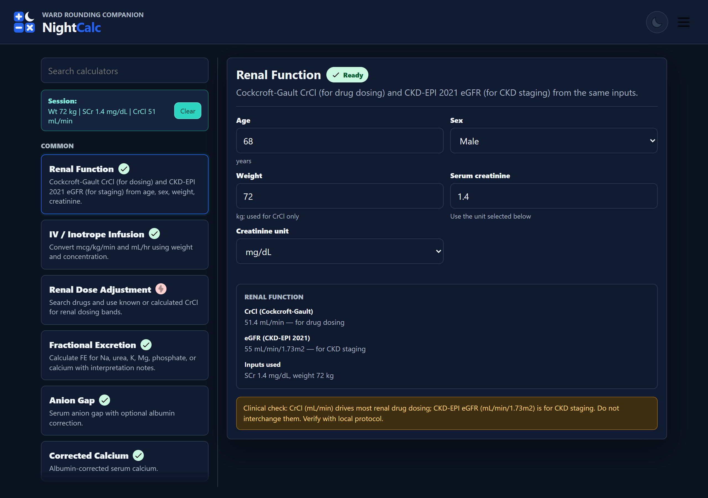
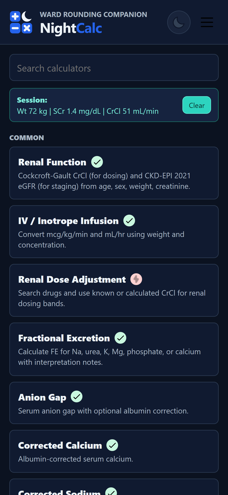
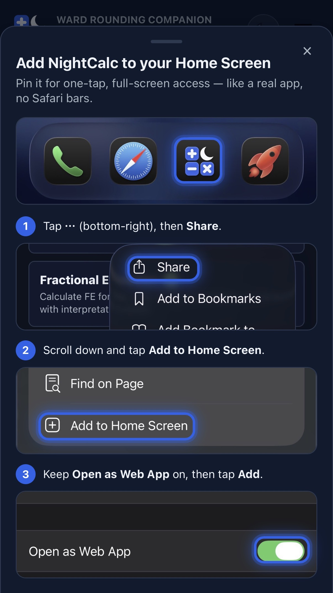
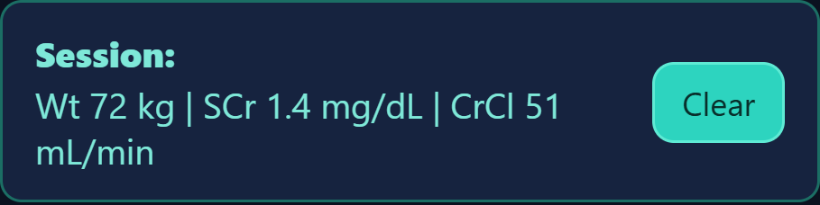

<p align="center">
  <picture>
    <source media="(prefers-color-scheme: dark)" srcset="design/blue/lockup-dark.svg">
    
  </picture>
</p>

# NightCalc

NightCalc is a simple, lightweight medical calculator app for the physician working at night — a calm bedside companion that quickly performs common clinical calculations while the ward sleeps. It is designed to be fast, easy to use, and accessible from any device, with a dark "night" theme, a selectable brand accent (blue or maroon), and a selectable visual skin (Default or a retro Pixel skin).

<div align="center">
  <table>
    <tr>
      <td align="center"></td>
      <td align="center"></td>
    </tr>
    <tr>
      <td align="center"><b>Desktop version</b></td>
      <td align="center"><b>Mobile version</b></td>
    </tr>
  </table>
</div>

## How to Use

NightCalc runs entirely in your browser — nothing to install. Just open the hosted app:

### ▶ [Open the live demo](https://solst1cee.github.io/NightCalc/)

It works on phone or desktop, and you can add it to your home screen for an app-like launch.

<p align="center">
  
</p>

<details>
<summary>Run locally (optional)</summary>

<br>

If you'd rather serve the files yourself, run a static server from the project root:

```powershell
python -m http.server 4173 --bind 127.0.0.1
```

Then open:

```text
http://127.0.0.1:4173/
```

</details>

## Features

### Session Memory

Enter a value once and NightCalc reuses it everywhere. While you work on the same patient, an input like **body weight** entered in one calculator is automatically carried into the others — so you don't re-type weight, serum creatinine, or a calculated CrCl across tools. It makes a full ward round on one patient fast and friction-free.

The live session box shows the values currently being shared across calculators, with one tap to clear them:

<p align="center">
  
</p>

Inputs and reusable outputs are stored in `sessionStorage`, so they last only for the current browser session and clear when you close the tab. No patient identifiers are requested or stored.

Examples of reused values:

- weight
- serum creatinine
- calculated CrCl
- recently used infusion concentration

### Theme

- Light/dark follows the device preference by default and can be toggled with the sun/moon button.
- The brand accent (blue by default, maroon optional) is selectable from the Info menu and saved across sessions. More accents can be added with one CSS block plus one entry in the `ACCENTS` list in `app.js`.
- A visual **skin** (Default, or a retro 8-bit **Pixel** skin) is selectable from the Info menu and saved across sessions. The Pixel skin reuses the existing colors, so it works in every theme/accent combination.
- Per the brand's "alert-red rule," the accent only colors chrome (logo, headers, buttons, links) — never a clinical result or warning value.

Theme, accent, and skin are each remembered across sessions (saved to `localStorage`).

## Calculators

Each calculator updates automatically as you fill the required fields — there is no calculate button.

| Calculator | What it does | Status |
| --- | --- | --- |
| Renal Function | Cockcroft-Gault CrCl (for drug dosing) and CKD-EPI 2021 eGFR (for CKD staging) from age, sex, weight, creatinine. | Ready |
| IV / Inotrope Infusion | Two-way dose-rate ↔ infusion-rate editor with drug/concentration presets, unit conversion, and line-limit warnings. | Ready |
| Renal Dose Adjustment | Renal dosing bands by known or calculated CrCl. | Down — dosing data is placeholder-only |
| Fractional Excretion | FE for sodium, urea, potassium, magnesium, phosphate, or calcium, with interpretation notes. | Ready |
| Anion Gap | Serum anion gap with optional albumin correction. | Ready |
| Corrected Calcium | Albumin-corrected serum calcium. | Ready |
| Corrected Sodium | Hyperglycemia-corrected serum sodium (1.6 and 2.4 factors). | Ready |
| qSOFA | Quick SOFA bedside sepsis screen (0–3). | Ready |
| QTc | Corrected QT — both Bazett and Fridericia — from QT and heart rate. | Ready |
| Ideal / Adjusted Body Weight | Devine ideal body weight, plus adjusted body weight when actual weight is entered. | Ready |
| CURB-65 | Community-acquired pneumonia severity (0–5). | Ready |
| CHA₂DS₂-VASc | Atrial-fibrillation stroke risk (0–9). | Ready |
| Glasgow Coma Scale | Conscious level by eye/verbal/motor (3–15). | Ready |
| NEWS2 | National Early Warning Score 2 from vital signs. | Ready |
| CIWA-Ar | Alcohol withdrawal severity (0–67). | Ready |
| Child-Pugh | Cirrhosis severity (Class A/B/C). | Ready |
| Wells Score (PE) | Pretest probability of pulmonary embolism. | Ready |
| Mean Arterial Pressure | MAP from systolic and diastolic blood pressure. | Ready |
| Winter's Formula | Expected PaCO₂ for a metabolic acidosis — checks respiratory compensation. | Ready |
| Serum Osmolality + Osmolar Gap | Calculated osmolality and the osmolar gap (toxic-alcohol screen). | Ready |
| Free Water Deficit | Estimated free-water deficit in hypernatremia. | Ready |
| Sodium Correction (Adrogué–Madias) | Predicted change in serum sodium per litre of infusate. | Ready |
| A–a Oxygen Gradient | Alveolar–arterial oxygen gradient vs the age-expected normal. | Ready |
| MELD-Na / MELD 3.0 | Cirrhosis severity / transplant-listing scores. | Ready |
| HEART Score | Chest-pain risk of a major adverse cardiac event at 6 weeks (0–10). | Ready |
| Revised Cardiac Risk Index | Pre-operative cardiac risk for non-cardiac surgery (0–6). | Ready |
| Wells Score (DVT) | Pretest probability of deep vein thrombosis. | Ready |
| PERC Rule | PE rule-out criteria for low-risk patients. | Ready |
| ABCD² Score | Short-term stroke risk after a TIA (0–7). | Ready |
| Glasgow-Blatchford Score | Upper-GI-bleed risk (0–23). | Ready |
| NIHSS | NIH Stroke Scale — stroke severity (0–42). | Ready |
| SOFA Score | Sequential Organ Failure Assessment — organ dysfunction (0–24). | Ready |
| Urine Anion Gap | Localises a normal-anion-gap metabolic acidosis (renal vs GI). | In progress |
| P/F Ratio | PaO₂/FiO₂ oxygenation and ARDS severity grading. | In progress |
| FIB-4 Index | Non-invasive estimate of liver fibrosis. | In progress |
| Maddrey Discriminant Function | Alcohol-associated hepatitis severity. | In progress |
| HbA1c → eAG | Estimated average glucose from HbA1c. | In progress |
| HAS-BLED | Bleeding risk on anticoagulation for AF (0–9). | In progress |
| SIRS Criteria | Systemic inflammatory response (0–4). | In progress |
| 4Ts Score (HIT) | Pretest probability of heparin-induced thrombocytopenia (0–8). | In progress |
| Reference | Source inventory for calculator data and future guideline updates. | In progress |

The infusion drug data is intentionally a draft scaffold; verify and replace values with local protocol/reference data before clinical use.

## Clinical Safety

This app is for workflow testing. Drug dose bands are placeholders and must be replaced with verified local protocols or references before clinical use.

## Credits

UI glyphs (menu, check, pickaxe, lightning bolt, and the GitHub/Gmail marks) are by [Icons8](https://icons8.com).
